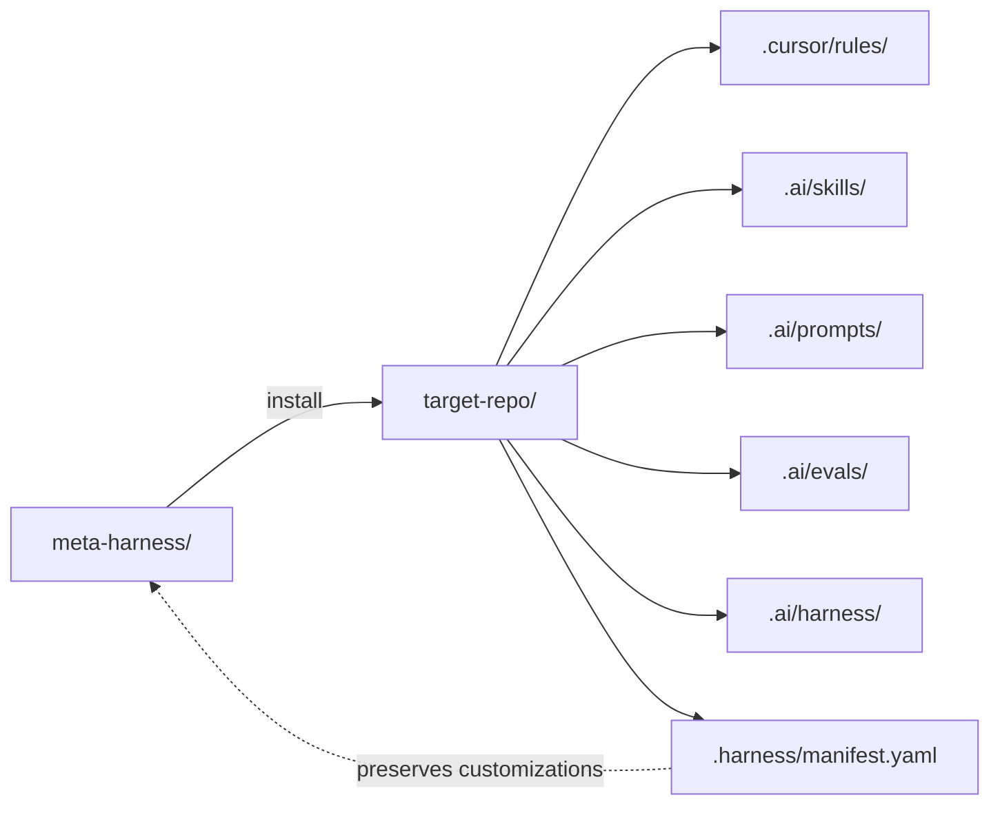

# Personal Meta-Harness

A portable, file-based AI agent harness for Cursor-first software projects.

Copy this folder to any new project, run one command, and you get a full
operating model: Cursor rules, a curated skill registry, prompts, evals,
and an intake. Customize the skills for your stack, then ship.

## What's in the box

- `cli/harness.mjs` — Node.js CLI: `init`, `install`, `diff`, `update`,
  `list`, `add`, `remove`, `doctor`.
- `bundles/` — the content that gets copied into a target repo:
  - `rules/` — Cursor `.mdc` files (meta, coding style, safety, tooling).
  - `skills/` — 23 skills across 5 groups (core, frontend, ai, quality,
    workflow).
  - `prompts/` — bootstrap, classify, load-skill, review-changes.
  - `evals/` — code-quality, ui-6-pillar, ai-integration, ship-readiness.
  - `harness/` — project-intake, profile template, router template.
- `stacks/` — overlays for `nextjs`, `python-fastapi`, `node-express`,
  `generic`. Each adds a stack-specific `.mdc` rule and a
  conventions skill.
- `registry/skills.yaml` — declarative index of every skill.
- `meta.yaml` — version, defaults, supported stacks.
- `CHANGELOG.md` — semver history.
- `.github/workflows/` — CI hooks that run `harness doctor` + `node --test`.
- `test/` — `node --test` suite for the YAML parser and the copier.

## Operating model



The agent's loop inside a target repo:

1. Classify the request.
2. Load matching skill(s).
3. Read only the relevant files.
4. Plan the smallest safe change.
5. Implement surgically.
6. Validate with the project's own commands.
7. Report changed files, checks, risks, next step.
8. If the agent fails, record it in `.ai/harness/failure-log.md`.

## How to use in a new repo

1. **Copy** this `harness/` folder to a new location, or vendor it as a
   submodule.
2. From the **target repo root**, run:
   ```bash
   node /path/to/harness/cli/harness.mjs init nextjs
   node /path/to/harness/cli/harness.mjs install
   ```
3. Open the target repo in Cursor.
4. Run the **bootstrap prompt** from `.ai/prompts/bootstrap.prompt.md` (or
   paste the text from the install output). The agent will:
   - Detect the stack and fill `.ai/harness/project-intake.md`.
   - Customize `.ai/harness/profile.yaml` and `router.yaml`.
   - Tailor 3-5 skills most likely to be used first.

## Two-way sync

`.harness/manifest.yaml` lives in the target repo and tracks every file
copied from the meta-harness bundle. Each file has a status:

- `pristine` — matches the bundle source. Will be overwritten on
  `harness update`.
- `customized` — the user has edited it. Will NOT be overwritten. Conflicts
  with the next bundle release are flagged in `harness diff`.
- `conflict` — both the bundle and the user changed the file. Resolve by
  hand, then run `harness update` again to reconcile.

This means **upgrading the meta-harness never clobbers your work**.

## CLI reference

```text
harness init [stack]              # generate .harnessrc, print intake prompt
harness install [--stack=X]       # copy bundle into target, write manifest
harness diff                      # show what would change vs installed
harness update [--stack=X]        # apply changes w/ conflict resolution
harness list [--available]        # show installed / available skills
harness add <skill-id>            # copy a skill on-demand
harness remove <skill-id>         # remove a skill from target
harness doctor                    # validate manifest, missing files, hash drift
```

All commands accept `--json` for machine-readable output.

## Versioning

- SemVer in `meta.yaml` (`version: 0.1.1`).
- `CHANGELOG.md` per release.
- MAJOR bump if `schema_version` changes.
- MINOR bump for new skills / rules.
- PATCH bump for wording fixes.

The target repo records `harness_version` in its manifest. `harness diff`
will show available updates.

## CI

Two GitHub Actions workflows are included:

- `.github/workflows/doctor.yml` — runs `harness doctor` and `harness diff`
  on every push and PR. Catches manifest drift and surfaces pending
  bundle updates.
- `.github/workflows/test.yml` — runs the `node --test` suite.

Run them locally with `npm run harness:ci` and `npm test`.

## Design philosophy

- Small composable skills beat one giant prompt.
- Rules define non-negotiables.
- Skills define task workflows.
- Prompts trigger repeatable operations.
- Evals/checklists define whether work is done.
- Failure logs improve the system over time.
- Customizations to a skill are made in the project's copy, never in the
  meta-harness source.
